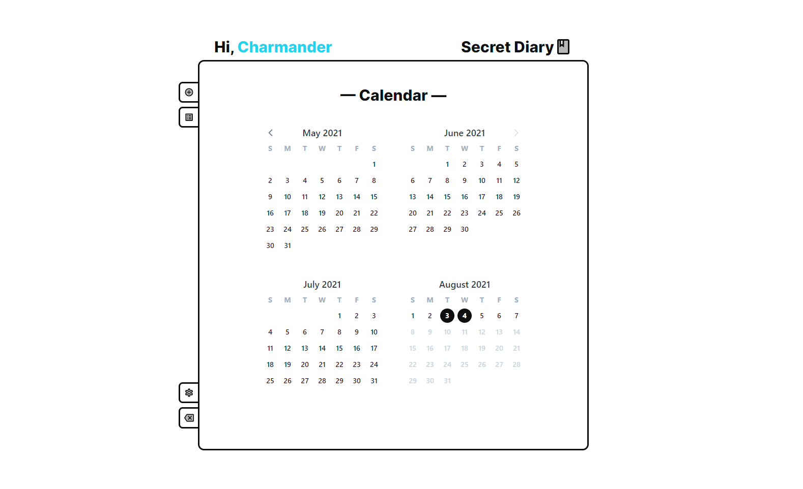
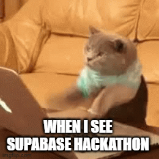
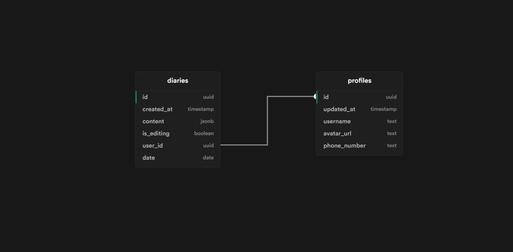

<!-- PROJECT LOGO -->
<br />
<p align="center">
  <a href="https://github.com/zernonia/secret-diary">
    
  </a>

  <h3 align="center">Secret Diary</h3>

  <p align="center">
    Secret Diary Apps (submission for <strong><a href="https://supabase.io/">Supabase Hackathon</a></strong>)
    <br />
    <br />
    <a href="https://secret-diary.vercel.app/">View Demo</a>
    ·
    <a href="https://github.com/zernonia/secret-diary/issues">Report Bug</a>
    ·
    <a href="https://github.com/zernonia/secret-diary/issues">Request Feature</a>
  </p>
</p>



## 🚀 Features

- 🔨 No installations required
- 🔒 Data can be hosted on your own [Supabase](https://supabase.io/) Instance
- 🚪 Phone login, required OTP for initial Sign Up
- 👀 No Sensitive info required
- 🤚 Move your loving diary to Web

## 📇 Submission Info (for Hackathon)



### 👨‍💻 Team

- Zernonia (@zernonia)

### Project Idea

I want to quickly built an app that utilized Supabase RLS and Storage policies, and suddenly thought of this **Secret Diary** idea on my bed, becauase.... what else requires more security than your very dear Diary 📘!

### ⚡ How I utilize Supabase

1. Supabase **Phone Auth [(new release)](https://supabase.io/blog/2021/07/28/supabase-auth-passwordless-sms-login)**

   - Trying to re-create Real Diary experience where Privacy & Access is super important. Therefore, using OTP should be much safer for Web Applications.
   - **Note:** Due to Twilio Trial Version, I have to use verified Caller ID to pre-register 1 account for the judges _(Login: +60172542822 , Password: 123456)_. Also, to prevent judges not able to login when I'm asleep, I had to use Phone + Password login instead.
   - From this project, I also discovered a [Bug related to Phone Auth](https://github.com/supabase/supabase-js/issues/222) too

2. Supabase **Database**

   - Trying to re-create the Real Diary experience where whatever the users has written down is automatically saved inside the diary, in this saved in Supabase Database.
   - To make sure data is secured, I've enabled RLS and created simple policies where `auth.uid() = user_id` for all `SELECT`, `UPDATE`, `INSERT` and `DELETE`.
   - Simple Schema for the project, generated from [Supabase Schema](https://supabase-schema.vercel.app/). 

3. Supabase **Storage**

   - Similarly, Real Diary has images pasted in it. Thus, Supabase Storage comes in handy where users can directly upload to the folder specific to them inside a bucket, thus allow to safe guard those assets.
   - To ensure personal images does not expose to other user, I've used the **Storage Policies** to quickly `Give users access to own folder`.

### 🔨 Built With

- [Vue 3](https://v3.vuejs.org/)
- [Vite](https://vitejs.dev/)
- [WindiCSS](https://windicss.org/)
- [Supabase](https://supabase.io)

## 🌎 Local Development

### Prerequisites

Yarn

- ```sh
  npm install --global yarn
  ```

### Development

1. Clone the repo
   ```sh
   git clone https://github.com/zernonia/secret-diary.git
   ```
2. Install NPM packages
   ```sh
   yarn install
   ```
3. Run Development instance
   ```sh
   yarn dev
   ```

## 📜 License

Distributed under the MIT License. See `LICENSE` for more information.

## 📧 Contact

Zernonia - [@zernonia](https://twitter.com/zernonia) - zernonia@gmail.com
